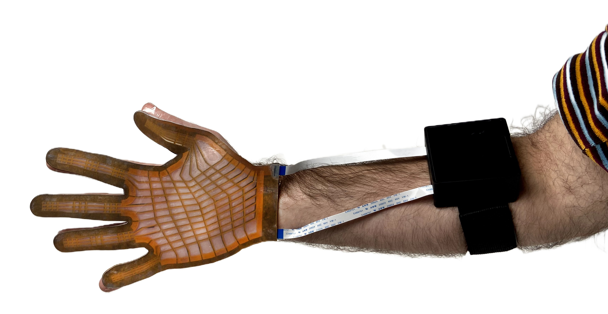

# WiReSens Glove

## A cost-effective, accessible pressure sensing glove based on flexible printed circuit board technology

<!-- <nav class="main-nav">
  <a href="/">Home</a>
  <a href="/order/">Order Our Designs</a>
  <a href="/make/">Make your own Design</a>
  <a href="/manufacturing/">Manufacturing + Assembly Guide</a>
  <a href="https://forms.gle/your-form-link" target="_blank">Request Pre-Made Kit</a>
  <a href="/recording/">Recording Instructions</a>
  <a href="/applications/">Applications</a>
</nav> -->

## Capture relative force distributions across the full palm

- Will show video of Small size and Large Size increasing pressure for each finger region and center of hand

## Wirelessly capture dexterous manipulation in any environment

- Will show video of example manipulations captured in the wild (Fencing, Cooking, Playing Piano, etc.)

## Fully Open Source Ecosystem

- Graphic which shows sensors, readout circuit, software/visualization

Sensors that are reproducible and can be directly ordered from the materials listed on this site

## Automated Design to fit the Unique Contours of Human Hands

- Image showing unique designs and screen grabs of the design process 