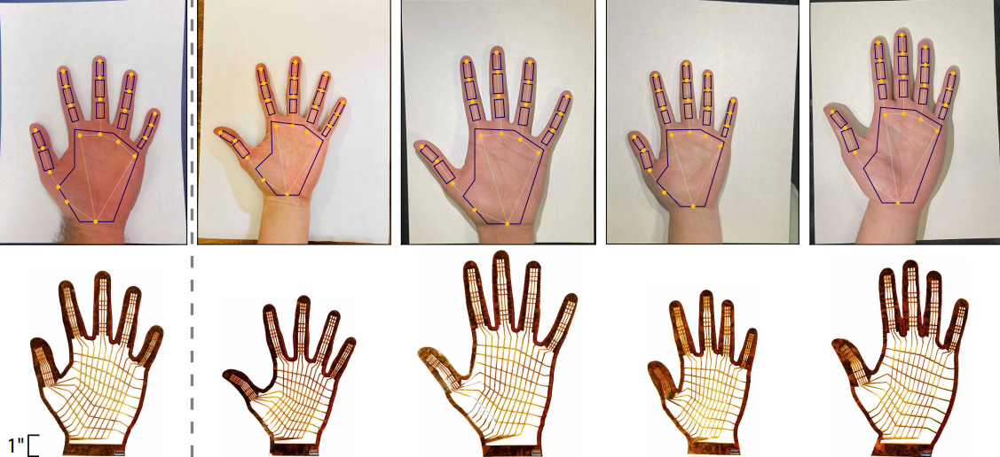

# WiReSens Glove

## A Cost-Effective, Accessible Pressure Sensing Glove based on Flexible Printed Circuit Board Technology

<!-- <nav class="main-nav">
  <a href="/">Home</a>
  <a href="/order/">Order Our Designs</a>
  <a href="/make/">Make your own Design</a>
  <a href="/manufacturing/">Manufacturing + Assembly Guide</a>
  <a href="https://forms.gle/your-form-link" target="_blank">Request Pre-Made Kit</a>
  <a href="/recording/">Recording Instructions</a>
  <a href="/applications/">Applications</a>
</nav> -->

## Capture Relative Force Distributions Across the Full Palm

  <iframe 
    src="https://www.youtube.com/embed/XlyN0DDsffI?autoplay=1&mute=1&loop=1&playlist=XlyN0DDsffI" 
    style="position: absolute; top: 0; left: 0; width: 100%; height: 100%;" 
    frameborder="0" 
    allow="autoplay; encrypted-media" 
    allowfullscreen>
  </iframe>

## Wirelessly Capture Dexterous Manipulation in any Environment

  <iframe 
    src="https://www.youtube.com/embed/6O8kKXV7YOk?autoplay=1&mute=1&loop=1&playlist=6O8kKXV7YOk" 
    style="position: absolute; top: 0; left: 0; width: 100%; height: 100%;" 
    frameborder="0" 
    allow="autoplay; encrypted-media" 
    allowfullscreen>
  </iframe>

## Fully Open Source Ecosystem

<video autoplay muted loop playsinline>
  <source src="assets/opensource.mp4" type="video/mp4">
  Your browser does not support the video tag.
</video>

## Automated Design to Fit the Unique Contours of Human Hands

If you use the WiReSens Gloves in your research, please cite our [paper](https://dl.acm.org/doi/10.1145/3706599.3720147):

  <button class="copy-btn" onclick="copyBibtex(this)">Copy</button>
  <pre><code class="language-bibtex">
@inproceedings{10.1145/3706599.3720147,
  author    = {Murphy, Devin and Li, Yichen and Owens, Crystal Elaine and 
               Stanton, Layla and Liang, Paul Pu and Luo, Yiyue and 
               Torralba, Antonio and Matusik, Wojciech},
  title     = {Fits like a Flex-Glove: Automatic Design of Personalized FPCB-Based Tactile Sensing Gloves},
  year      = {2025},
  isbn      = {9798400713958},
  publisher = {Association for Computing Machinery},
  address   = {New York, NY, USA},
  url       = {https://doi.org/10.1145/3706599.3720147},
  doi       = {10.1145/3706599.3720147},
  booktitle = {Proceedings of the Extended Abstracts of the CHI Conference on Human Factors in Computing Systems},
  articleno = {280},
  numpages  = {8},
  keywords  = {Tactile Sensing, Flexible PCB, Wearable Devices},
  series    = {CHI EA '25}
}
  </code></pre>

