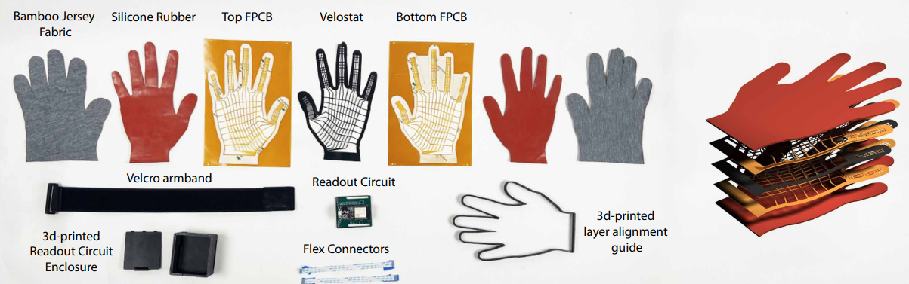
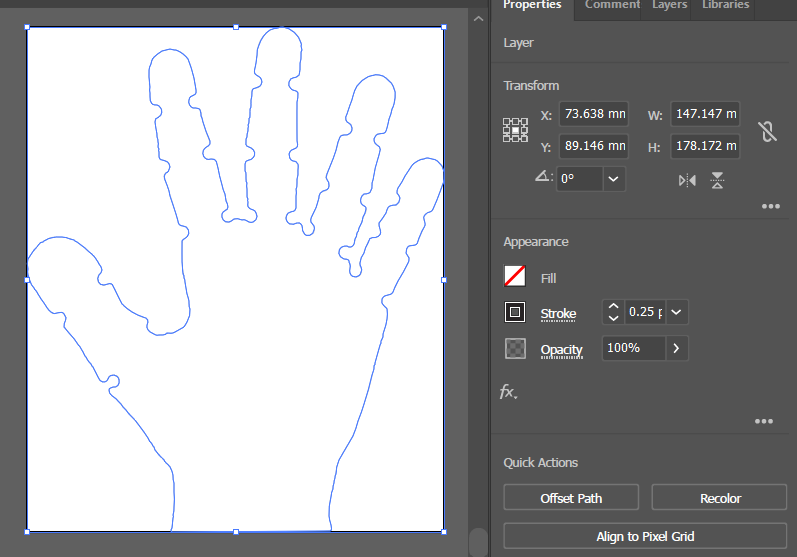
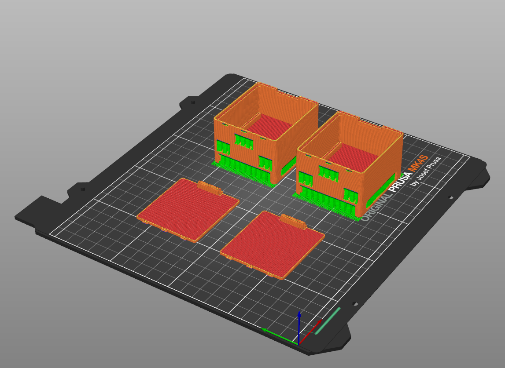

# Manufacturing + Assembly Guide

Before starting, make sure you’ve completed the steps in the [Ordering Guide](https://wiresens-gloves.vercel.app/order/) to obtain all required materials. A visual overview of the necessary materials is shown below:

To build the gloves, you will need access to:

* A **laser cutter** (CO₂ recommended)
* A **3D printer** (PLA filament recommended)

If you do not have access to these tools, you may use external vendors. We provide examples for laser cutting and 3D printing in the relevant sections below.

### Overview of Steps

1. Laser cut silicone rubber and Velostat layers
2. 3D print the readout circuit enclosure and alignment guide
3. Align and assemble the sensor layers, then attach flex cables
4. Glue the sensor assembly into the glove
5. Connect the glove to the readout circuit using flex cables

---

## Step 1: Laser Cut Supporting Layers

<video autoplay muted loop playsinline>
  <source src="../assets/LaserCut.mp4" type="video/mp4">
  Your browser does not support the video tag.
</video>

You will cut **two adhesive-backed silicone rubber layers** and **one Velostat layer**.

If you don’t have a laser cutter, you can outsource the job to:

* [SendCutSend (rubbers/plastics)](https://www.sendcutsend.com)
* [Ponoko (small-scale fabrication)](https://www.ponoko.com)

**Instructions:**

1. Download the appropriate SVG outline:

   * [Small Glove Cut](assets/smallGloveCut.svg)
   * [Large Glove Cut](assets/largeGloveCut.svg)

2. Open the SVG in your laser cutter software. Ensure the document units are set to **millimeters (mm)**. Verify the dimensions:

   * Small outline height: **178.17 mm**
   * Large outline height: **209.75 mm**

   

3. Refer to [`lasercutting.txt`](assets/lasercutting.txt) for recommended **power, speed, and frequency settings**.

4. Cut the following:

   * **Two silicone rubber layers:**

     * One in the default orientation
     * One mirrored horizontally
   * **One Velostat layer**

---

## Step 2: 3D Print Enclosure and Alignment Guide

If you don't have a 3d printer, you can outsource the job to [Xometry](https://www.xometry.com/capabilities/3d-printing-service/pla/)

**Instructions:**

1. Download the STL files:

   * Enclosure (both files needed): [Top](assets/pcbhousingtop.stl), [Bottom](assets/pcbhousingbottom.stl)
   * Alignment guide (choose the one for your size): [Large](assets/largeGloveNestSized.stl), [Small](assets/gloveSmallNestSized.stl)

2. Print using **PLA filament**.

   * Add supports (automatic painting for overhang > 25%  is sufficient).

---

## Step 3: Align Sensor Layers and Attach Cables

⚠️ This is the **most delicate step**. Work carefully to avoid damaging the layers.

**Instructions:**

1. Place one **silicone rubber PCB layer** (adhesive side up) into the alignment nest.

   * Remove adhesive backing.
   * Place the Velostat layer on top and press along the edges.
   * Remove the two-layer stack from the nest.

2. Flip the nest over. Place the **second PCB layer** adhesive side up.

   * Remove adhesive backing.
   * Place the two-layer stack (from step 1) on top, Velostat side down.
   * Press edges to seal. Remove the three-layer stack.

3. Place an adhesive-backed silicone rubber layer into the nest, adhesive side up.

   * Remove backing.
   * Place the three-layer stack on top. Press edges to seal. Remove four-layer stack.

4. Flip the nest. Place the **second silicone rubber layer** adhesive side up.

   * Remove backing.
   * Place the four-layer stack PCB side down. Press edges to seal. Remove the final **five-layer sensor assembly**.

5. Locate the flex connectors on the top and bottom sensor layers.

   * Gently flip them up, insert a flex cable into each connector, then flip down to lock.

---

## Step 4: Glue Sensor into Glove

**Instructions:**

1. Turn the glove **inside out** and wear it, with the grippy side touching your palm.
2. Place the sensor on the table in the same orientation as your hand. You can verify the orientation by placing the hand wearing the glove onto the sensor and making sure the thumbs and pinky fingers touch.
3. Apply **super glue** to the **tips of each sensor finger**.

   * Touch the glove fingertips to the glued sensor tips.
   * Hold in place for \~45 seconds.
4. Remove the glove, then flip it inside out again so that the sensor is now inside.

---

## Step 5: Connect Glove to Readout Circuit

**Instructions:**

1. Solder the female header pins onto the **same side of the readout circuit** that contains the flex cable connectors.

   * Insert the Adafruit Feather ESP32 microcontroller into the headers, aligning with the **back pins** (some pins on USB port side will hang free - this is expected).

2. Place the glove **grippy side up** on the table.

3. Thread each flex cable through the corresponding slots in the 3D-printed enclosure.

4. Connect the flex cables to the readout circuit’s flex connectors.

5. Fit the readout circuit firmly into the enclosure base and close the lid.

6. Flip the enclosure over and thread a **Velcro armband** through the bottom slots for secure attachment.