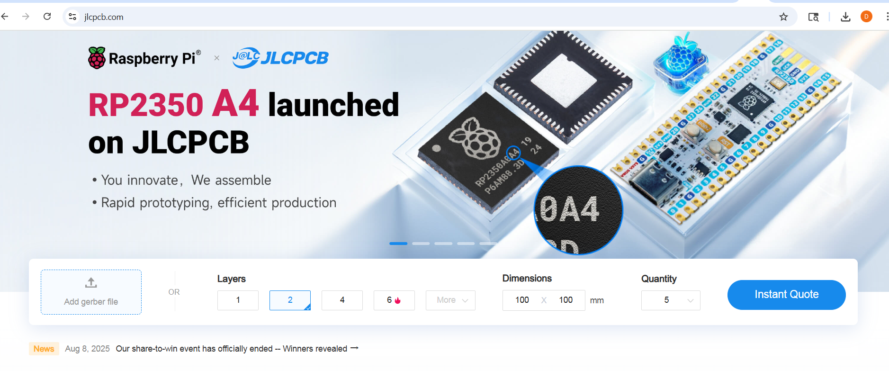
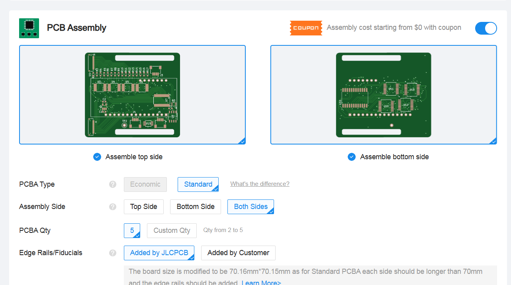
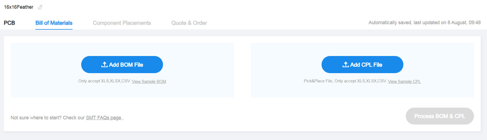
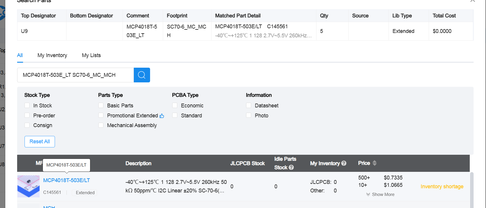
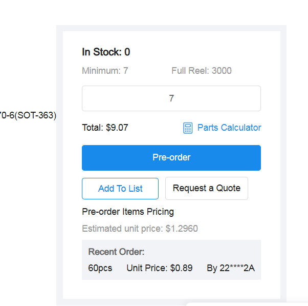
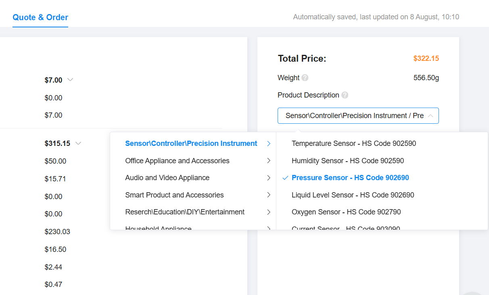
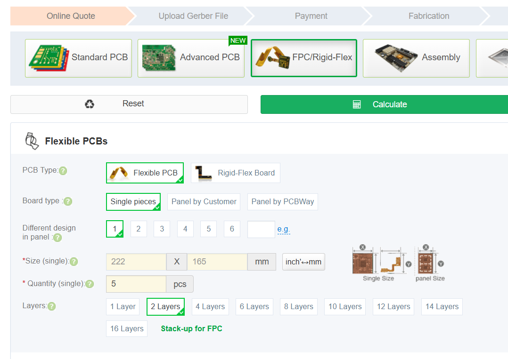
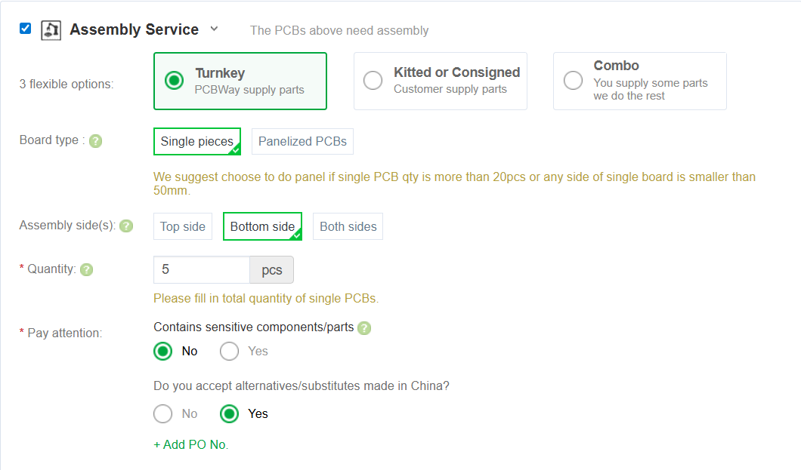
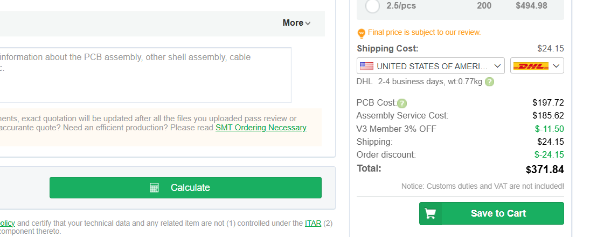

# Order Our Designs

## Readout Circuit

The WiReSens Gloves use a zero-potential scanning readout circuit (shown to [reduce cross talk](https://www.sciencedirect.com/science/article/abs/pii/S0924424798002040) between electrodes in resistive sensing arrays). You can order the circuits fully assembled (minus the header pins) from JLCPCB. 

1. Head to [JLCPCB](https://jlcpcb.com/) and upload the gerber file: ([download](assets/16x16Feather.zip))

2. Enter the number of boards you'd like to order under "PCB Qty" (you need one for each glove). 

3. The other default settings are fine. Scroll down to PCB Assembly. And select "Standard" for PCBA type and "Both sides' for assembly side

4. Select desired build time and click "Next"

5. Upload the Bill of Materials  (BOM) ([download](assets/bom.csv)) and Component Placement (CPL) ([download](assets/positions.csv)) files

6. Review the matched parts, making sure all are selected and none are in shortfall. 

If any parts are in shortfall, you can either order them to your parts library (so that you may order the board when the components are in stock) or order them to your address and solder them yourself.  To add shortfall components to your part library, click the Search icon in the Matched Part Detail of the shortfall part.

A window will show up with a list of parts matching the shortfall. Check that the first part patches the description, and click on it.

Change the QTY to the desired number of components (at least covering what is in shortfall, but you can always order more to be safe) and preorder.

7. Click "next" on component placements, and on the quote and order tab select "Sensor/Controller/Precision Instrument -> Pressure Sensors" for the product description. Click save to cart and complete order. 

## Flexible Printed Circuit Board (FPCB) Electrodes

The gloves use flexible PCBs (FPCBs) to route sensing electrodes along the contour of the hand. **Two FPCBs are required per glove**—one for the **top array** and one for the **bottom array**.
You must **place two separate orders**: one for the top PCB and one for the bottom PCB.

Our reference designs are available in **large** and **small** sizes, or you can [create your own]().
We recommend using the [PCBWay Flex PCB Instant Quote Tool](https://www.pcbway.com/flexible.aspx) to manufacture both top and bottom boards.

---

### 1. Order the **Top PCB**

1. Open the Flex PCB Instant Quote Tool.
2. Enter the manufacturing details for your size:

   * **Large:** [download details (PDF)](assets/large_pcb_top_details.pdf)
   * **Small:** [download details (PDF)](assets/small_pcb_top_details.pdf)
     *(Follow the “Special Request” instructions exactly as listed in the PDF.)*
3. **Quantity tip:** The number you select equals the number of final sensors you’ll have. For example, ordering **2 top PCBs** yields enough for **2 sensors** (one glove pair).
   
4. If you want ready-to-use PCBs, add **assembly service**. For top PCBs, **components are assembled on the bottom side**.
   
5. Click **Calculate**, select your shipping speed, and save the order to your cart.
   
6. Upload the required files for your chosen size:

   * **Gerbers:** [Large](assets/Large_FPCB_Top_Gerbers.zip) | [Small](assets/Small_FPCB_Top_Gerbers.zip)
   * **BOM:** [Download](assets/flex_bom.xlsx)
   * **Centroid:** [Large](assets/large_top.pos) | [Small](assets/small_top.pos)
     
7. Once all files are uploaded, click **Submit Order Now**.

---

### 2. Order the **Bottom PCB**

Repeat the same process, but with **bottom PCB details and files**:

* **Manufacturing details:** [Large](assets/large_pcb_bot_details.pdf) | [Small](assets/small_pcb_bot_details.pdf)
* **Assembly side:** **Top**
* **Gerbers:** [Large](assets/Large_FPCB_Bot_Gerbers.zip) | [Small](assets/Small_FPCB_Bot_Gerbers.zip)
* **BOM:** [Download](assets/flex_bom.xlsx)
* **Centroid:** [Large](assets/large_back.pos) | [Small](assets/small_bot.pos)

## Other Materials for Assembly

For the readout circuit:

* [Adafruit Huzzah ESP32 Feather Board](https://www.digikey.com/en/products/detail/adafruit-industries-llc/3591/8119805?gclsrc=aw.ds&gad_source=1&gad_campaignid=20243136172&gbraid=0AAAAADrbLlgIO8C_ilnVVgWgsCbx8uOy1&gclid=CjwKCAjwwNbEBhBpEiwAFYLtGMsl5UhCbYTguXWj6P3x7uX0yz5KJd8kKBPR7fHwGWJzBXyPuz6oORoCrzEQAvD_BwE) - If operating wirelessly, two are needed per one glove.
* [2.54 mm header pins](https://www.amazon.com/2-54mm-Stright-Female-Single-Connector/dp/B0DYYL6CQF?gQT=1) (for connecting to the ESP32 Microcontroller)
* [0.5 mm Pitch Flex Cables (16-pin)](https://www.amazon.com/dp/B07RY9QZ4Q) (for connecting to the sensor. 2 needed per glove.)
* [PLA Filament](https://www.matterhackers.com/store/l/pro-series-pla/sk/MY6C8H7E) (for printing the circuit enclosure)
* [Velcro Wrist Strap](https://www.amazon.com/VELCRO-Brand-ONE-WRAP-Double-Sided-Multi-Purpose/dp/B00JWU77N2/ref=sr_1_11?crid=1D6ZL1G7ND6Z5&dib=eyJ2IjoiMSJ9.-ycYKzOndCCCo7OcaxsPn6GhyrddOLFoIcQyazfgWO7SVIA75XHtZBpQGx_JMi4wTVHZvnfa0gvC0lsRa9C2P4y6aCsHLD4FUdbySjZDON7TTznO8knROgZEPL1bII_-4wLK7bIxW_SzHMWVUY2ktHyXhrBMDMYBo70kYNMIoJJg82pmGvEUe3tB90TKeoABJuoY0-JS69h-A6MigTCtb3Z2ZdEwhlvzsE8bxezqwRPE-a1_edVr-PMw7uje8zeTHjqd_-KnGX8ApM-3Q9KCpZ_BygR95a3yvVvYuPOeExY.F-Git40A0vEgHGfnzXMoIRJ3LJ_HachBhDROv_GkK2o&dib_tag=se&keywords=amazon%2Bvelcro%2Broll&qid=1754663856&sprefix=amazon%2Bvelcro%2Broll%2Caps%2C102&sr=8-11&th=1) (one per glove)

For the sensor:
* [Adhesive-Backed Silicone Rubber (McMaster 9010K51)](https://www.mcmaster.com/catalog/131/4075/9010K51). A 24" x 24" sheet makes about 4 sensors (two pairs of gloves)
* [Pressure-sensitive Conductive Sheet (Velostat)](https://www.testequity.com/product/105ST1704-1704-36X150?gad_source=1&gad_campaignid=15361162544&gbraid=0AAAAACbfxe3enEdoGNHWxGsmpIO1VT7L9&gclid=CjwKCAjwwNbEBhBpEiwAFYLtGLfEWRpY1I3_rKat3TOYgGDo0PvJwmjR_XOuapeyblOQraFduUomABoC7JEQAvD_BwE)
* [Anti-slip Gloves](https://www.amazon.com/dp/B092HM55SQ?ref=ppx_yo2ov_dt_b_fed_asin_title&th=1)
* [Super Glue](https://www.amazon.com/GH1200-Brush-Applicator-Nozzle-Cyanoacrylate/dp/B0D9SR1XNP/ref=sr_1_3?dib=eyJ2IjoiMSJ9.XOjNPA5U1xDtBJUZWk7DHXejkpRsMFpxCZxejko5J5Tjvt_lrNILVLFK5RsFqUpz4QOA_ex2JyfQAYZJL-kKh9f3UIBBF4qseMsiLeo3JbH5UcLUeDwVSA2y3jMWUKmXs42pgt-5_zETAYzSXW7lBNhx_giOEf0A9kZz1F1MKeW-S_FHVVE_SFYUwWfsyemD0vOR9w5VDMar2zsSOmmtOpC6IoHWzX90ZB7kvMe8gFY.Bf2M33syK1qe436yDlzgt2DI8hMu6ps5K2PSACJ_9cw&dib_tag=se&hvadid=548236050385&hvdev=c&hvexpln=0&hvlocphy=9002000&hvnetw=g&hvocijid=14014353149079918094--&hvqmt=e&hvrand=14014353149079918094&hvtargid=kwd-1183129925929&hydadcr=29474_10168008&keywords=super+glue+on+amazon&mcid=14a6ea32bba73e9387210ce40e1804f5&qid=1754664474&sr=8-3)
