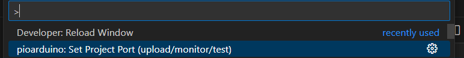
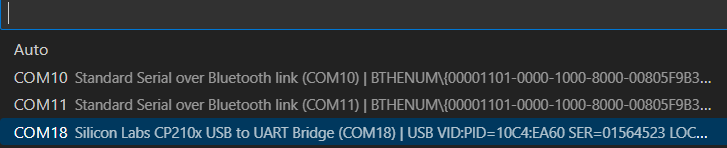
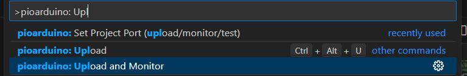
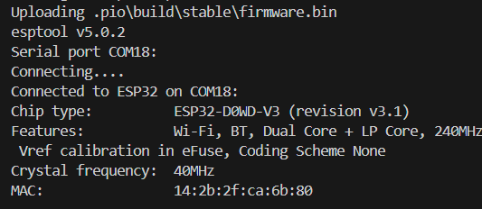
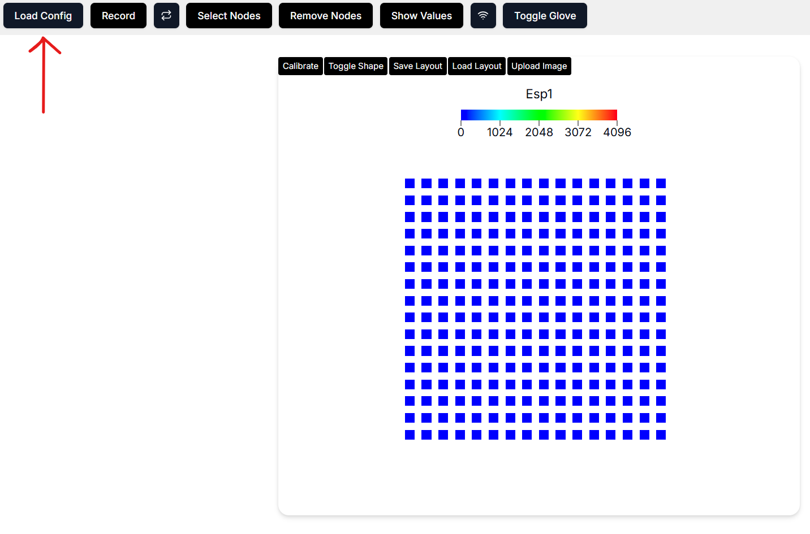
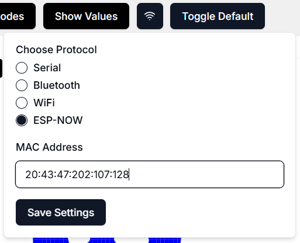
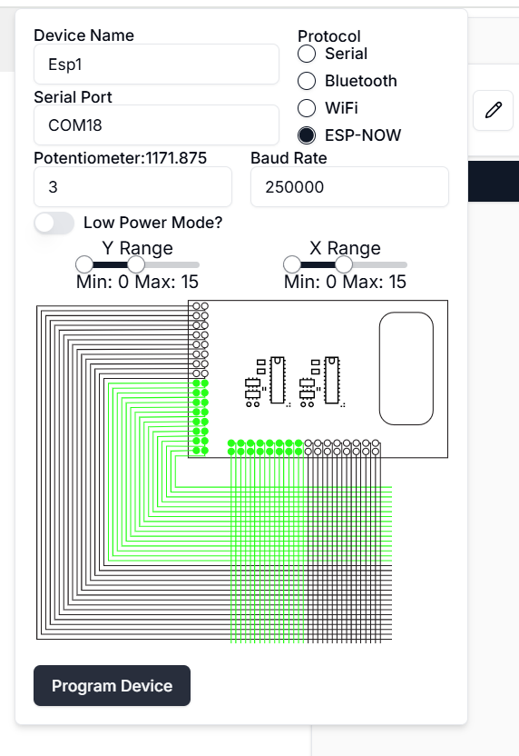
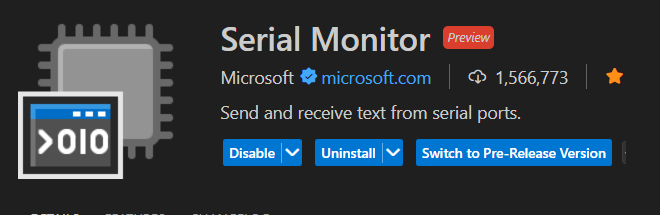

# Recording Instructions

Before recording with your gloves, you’ll need to:

1. Install the required software and firmware.
2. Upload firmware to your microcontrollers.
3. Configure the devices using the backend and GUI tools.

---

## 🚀 Quick Start (For Pre-Assembled Gloves)

If you already have a working set of gloves (you did not build them yourself), you can **skip straight to recording**:

1. Clone and install [WiReSensBackend](https://github.com/devinmur29/WiReSensBackend).
2. Plug the **receiver microcontroller** into your laptop.
3. Activate your Python environment.
4. Run port detection:

   ```bash
   python autoDetectPort.py [--small] [--left] [--right]
   ```

   * `--small` = if using small gloves
   * `--left` / `--right` = if recording from only one glove
5. If successful, you’ll see:

   ```
   ✅ Success: Config file used and ports discovered.
   ```
6. Start recording:

   ```bash
   python recordOnly.py [--small] [--left] [--right]
   ```

👉 That’s it! You’re ready to record.
👉 If you want to calibrate your gloves or use the Web GUI, continue with the sections below.

---

## 1. Install Software

Follow the installation instructions from the following repositories:

* **[WiSensToolkit](https://github.com/devinmur29/WiSensToolkit/tree/main):** Firmware for the microcontrollers
* **[WiReSensBackend](https://github.com/devinmur29/WiReSensBackend):** Python library for interfacing with sensors
* **[WiReSensWeb](https://github.com/devinmur29/WiReSensWeb) (Optional):** Real-time visualizer and GUI.

  * Use it online at [https://wi-re-sens-web.vercel.app/](https://wi-re-sens-web.vercel.app/)
  * Or set it up locally for offline access.

---

## 2. Upload Firmware

*(skip if gloves already shipped pre-flashed)*

### Transmitter vs. Receiver

* **Transmitter:** ESP32 connected to the readout circuit and glove sensor via flex cables.
* **Receiver:** Standalone ESP32 that receives wireless data from the transmitter and forwards it to your laptop.

👉 If using **ESP-NOW (recommended: fastest, longest range, most portable)**, upload firmware to **both** transmitter and receiver.
👉 If using **USB-Serial, WiFi, or Bluetooth**, upload firmware to the **transmitter only**.

---

### Upload Receiver Firmware

1. Connect an ESP32 (receiver) to your laptop via USB.
2. In VSCode, open the **WiSensToolkit** folder.

   * Set the serial port: `Ctrl + Shift + P` → search for `pioarduino: set project port` → select the port (e.g., *CP210x USB to UART Bridge*).
     
     
3. Open `platformio.ini` and set:

   ```
   build_src_filter = +<espReceive.cpp> -<scanArray.cpp> -<noCalibrate.cpp>
   ```
4. Upload with `pioarduino: Upload and monitor`.
   
5. In the serial monitor, copy the receiver’s MAC address and convert each hex pair to decimal (use [this converter](https://www.rapidtables.com/convert/number/hex-to-decimal.html)).
   Example: `14:2b:2f:ca:6b:80` → `20:43:47:202:107:128`
   
6. Disconnect the receiver.

---

### Upload Transmitter Firmware

1. Connect the ESP32 attached to the glove readout circuit.
2. In `platformio.ini`, set:

   ```
   build_src_filter = -<espReceive.cpp> -<scanArray.cpp> +<noCalibrate.cpp>
   ```
3. Upload with the same steps as the receiver.

---

## 3. Configure Transmitter

Configuration uses **WiReSensBackend** and the **Web GUI**:

1. Keep the transmitter connected via USB.

   * Start the backend:

     ```bash
     python startBackend.py
     ```
   * Open the GUI: [https://wi-re-sens-web.vercel.app/](https://wi-re-sens-web.vercel.app/) (or `localhost:3000` if local).
2. In the GUI, click **Load Config** and select the JSON file from the backend’s `configs` folder (e.g., `oneGloveTransmitter{Left|Right}.json`).
   
3. Click the **Wireless Comms (🛜)** button and paste the converted decimal MAC address from the receiver step. Save settings.
   
4. Open the **Device Panel → Edit Device**, set the serial port to the transmitter’s port, and click **Program Device**.
   
5. The transmitter can now run on USB or a LiPo battery.
   

---

## 4. Recording via Web GUI

1. Connect the **receiver** to your laptop.
2. Load the receiver config JSON (e.g., `oneGloveSerialReceiver{Left|Right}{Large|Small}.json`).
3. In the device panel, set the receiver’s serial port and click **Program Device**.
4. Click **Record** in the GUI.

---

## 5. Calibrating the Gloves

1. Ensure both transmitter and receiver are plugged in.
2. Install the **Serial Monitor** extension for VSCode.
   
3. In the GUI, switch to **Default Visualization** and start recording to see glove signals.
4. In the serial monitor, connect to the **transmitter’s port** at **250000 baud**.
   
5. **Noise Calibration:**

   * Type `noise` and press Enter.
   * Wait 1 min (no pressure needed). You’ll see “finished noise calibration” when done.
6. **Sensitivity Calibration:**

   * Type `mins` and press Enter.
   * Apply max pressure to every area of the glove until signals saturate (≈5 min).
   * Type `stopMins` when finished.
7. Reset the transmitter (button press or unplug/replug). Data is now calibrated.

---

## 6. Recording via Backend (Headless)

1. In **WiReSensBackend**, activate your Python environment.
2. With receiver microcontrollers connected to your laptop and transmitter microcontrollers powered, run port detection:

   ```bash
   python autoDetectPort.py [--small] [--left] [--right]
   ```

   * `--small` = using small gloves
   * `--left` / `--right` = only record one glove
   * Success message:

     ```
     ✅ Success: Config file used and ports discovered.
     ```
3. Record:

   ```bash
   python recordOnly.py [--small] [--left] [--right]
   ```


## Creating MP4 Videos of Tactile Recordings

The script `createViz.py` generates an MP4 visualization of tactile recordings from one or both glove HDF5 files.

### Usage

```bash
python createViz.py [--left_h5 LEFT_FILE] [--right_h5 RIGHT_FILE] [--small] [--output OUTPUT_FILE]
```

### Arguments

* `--left_h5 <path>`
  Path to the HDF5 file for the **left glove**.
  Example: `--left_h5 recordings/left_glove.hdf5`

* `--right_h5 <path>`
  Path to the HDF5 file for the **right glove**.
  Example: `--right_h5 recordings/right_glove.hdf5`

* `--small`
  Use the **smaller glove SVG visualization** instead of the default large glove.
  Example: `--small`

* `--output <filename>`
  Name of the output MP4 file (default: `tactile_overlay_cuda.mp4`).
  Example: `--output my_tactile_video.mp4`

### Requirements

* You must provide **at least one** of `--left_h5` or `--right_h5`.

### Example Commands

1. Visualize the left glove only:

   ```bash
   python createViz.py --left_h5 data/left.hdf5
   ```

2. Visualize both gloves and save to a custom file:

   ```bash
   python createViz.py --left_h5 recordings/left.hdf5 --right_h5 recordings/right.hdf5 --output both_gloves.mp4
   ```

3. Use the smaller glove visualization:

   ```bash
   python createViz.py --right_h5 recordings/right.hdf5 --small
   ```


